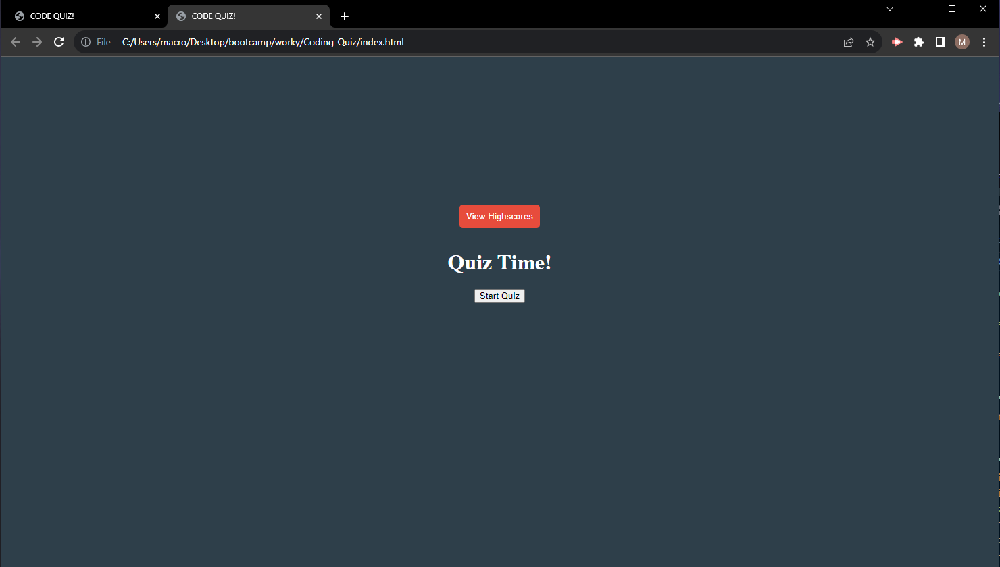

# <Maguire Wilson's Quiz'>

## Description

A simple webpage to take a silly quiz

## Table of Contents

- [Installation](#installation)
- [Usage](#usage)
- [Credits](#credits)
- [Features](#features)
- [screenshot](#screenshot)

## Installation

Using any web browser, open the provided URL and press the start

## Usage

Take a quiz. Log high-Scores. Learn a silly fact or two.

## Credits

Maguire Wilson.
various stackOverflow atricles on how to display scores in a list from local storage. https://stackoverflow.com/questions/5410745/how-can-i-get-a-list-of-the-items-stored-in-html-5-local-storage-from-javascript

## Features

Functional links [LINK TO ONLINE SITE] (https://macrowil.github.io/Coding-Quiz/)

## Screenshot

